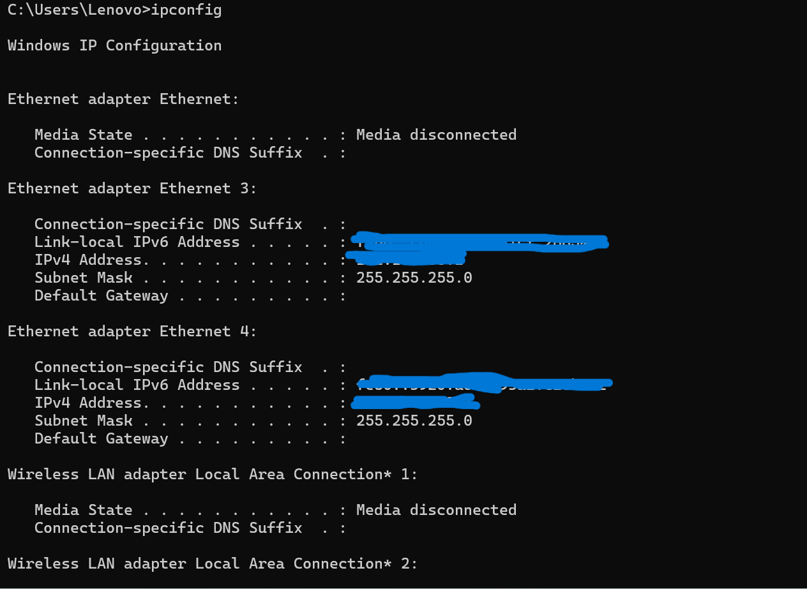
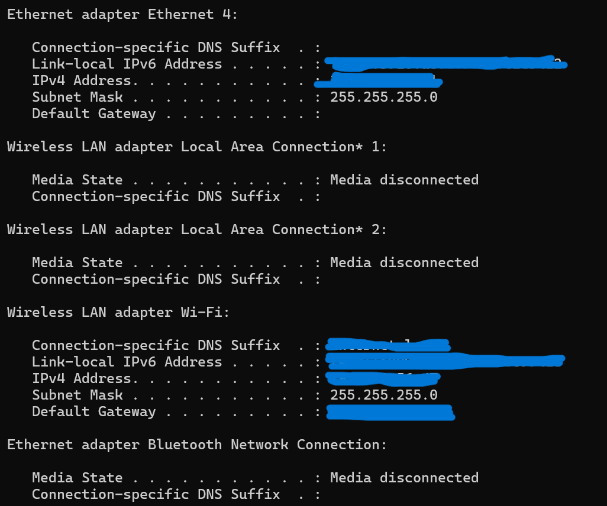
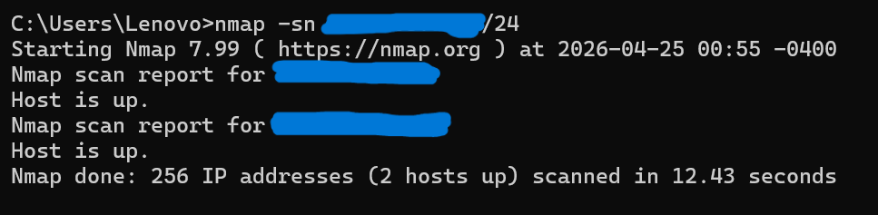
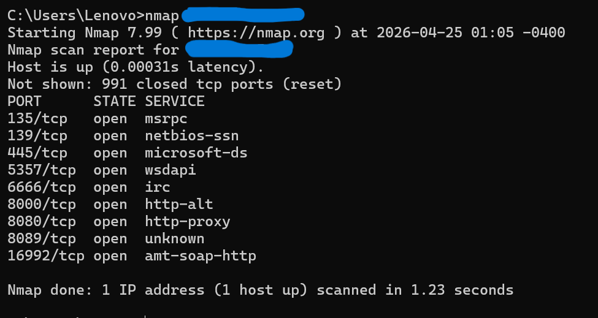

# 🔍 Network Scanning & Host Enumeration with Nmap

## 📋 Project Overview
Hands-on cybersecurity lab focused on network scanning and host enumeration using Nmap. 
This project simulates the reconnaissance phase of a security assessment to identify 
active hosts, open ports, and running services on a local network.

## 🎯 Objectives
- Discover active hosts on a local network
- Identify open ports and running services
- Perform OS detection and service version enumeration
- Document findings in a structured security assessment format

## 🛠️ Tools Used
- Nmap 7.99 (Windows)
- Command Prompt (Windows)
- VS Code / Notepad (documentation)

## 📁 Repository Structure
- `/screenshots` — Step-by-step evidence of scans performed
- `/findings` — Documented results and risk observations

## ⚠️ Legal Disclaimer
All scans were performed on a personal local network in a controlled lab environment. 
No unauthorized systems were scanned.
## 🖥️ Lab Walkthrough

### Step 1 — Nmap Installation Verification
Confirmed successful installation of Nmap 7.99 on Windows.
The version output validates the environment is ready for network scanning operations.

### Step 2 — Network Interface Discovery (ipconfig)
Used the `ipconfig` command to identify the active network interfaces
and determine the local IP range to be used for scanning.

**Key findings:**
- Multiple network adapters detected
- Active Wi-Fi adapter identified with a /24 subnet
- Network range determined for use in Nmap scanning

### Step 3 — Ping Sweep (Host Discovery)
Used `nmap -sn` to perform a ping sweep across the entire /24 subnet
to identify all active hosts without triggering port scans.

**Command used:**

nmap -sn  [target-ip]

**Results:**
- Scanned 256 IP addresses
- Discovered 2 active hosts on the network
- Scan completed in 12.43 seconds

### Step 4 — Port Scan (Service Discovery)
Performed a default port scan on the active host to identify
open ports and running services.

**Command used:**

nmap [target-ip]

**Results — 9 open ports discovered:**

| Port | Service | Notes |
|------|---------|-------|
| 135/tcp | msrpc | Windows RPC |
| 139/tcp | netbios-ssn | Windows NetBIOS file sharing |
| 445/tcp | microsoft-ds | SMB file sharing |
| 5357/tcp | wsdapi | Windows device discovery |
| 6666/tcp | irc | Unusual — warrants investigation |
| 8000/tcp | http-alt | HTTP service |
| 8080/tcp | http-proxy | HTTP proxy service |
| 8089/tcp | unknown | Unidentified service |
| 16992/tcp | amt-soap-http | Intel AMT remote management |

