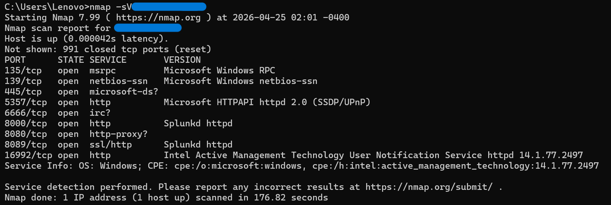
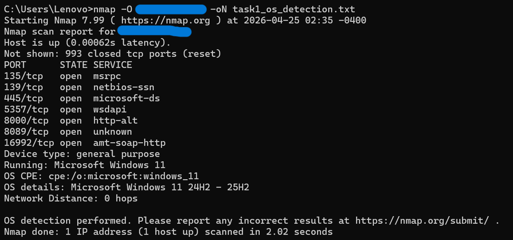
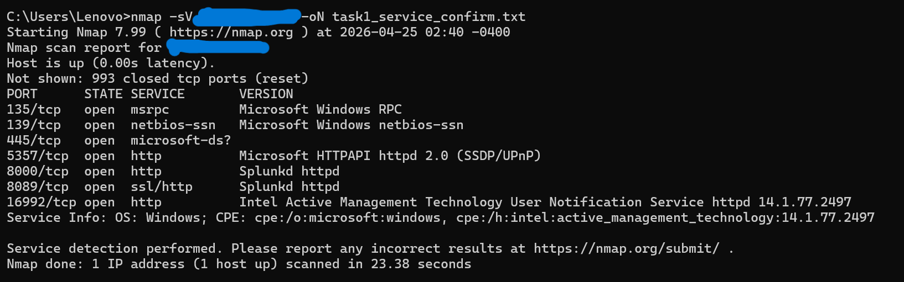
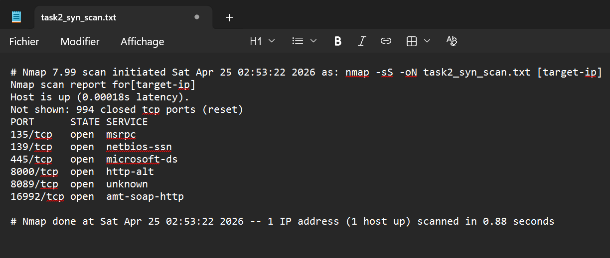
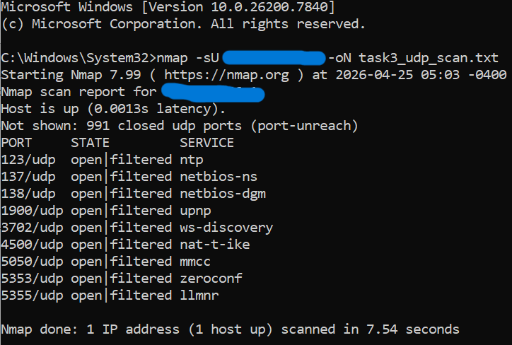
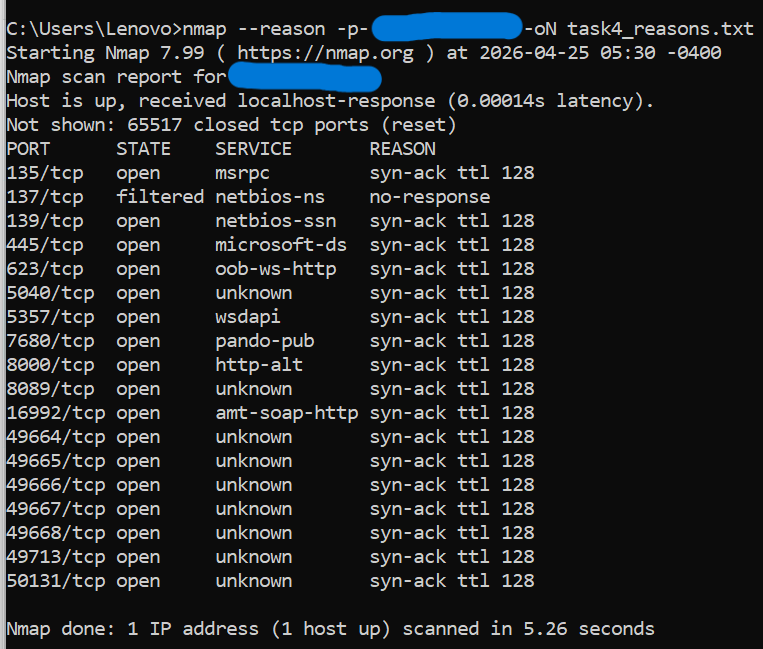
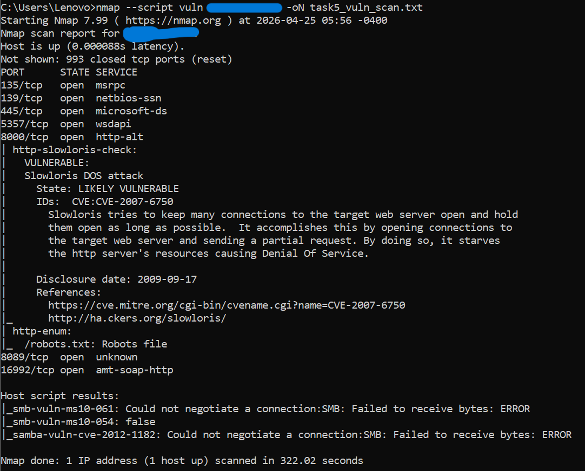

# 🔍 Network Scanning & Host Enumeration with Nmap

## 📋 Project Overview
Hands-on cybersecurity lab focused on network scanning and host enumeration using Nmap. 
This project simulates the reconnaissance phase of a security assessment to identify 
active hosts, open ports, and running services on a local network.

## 🎯 Objectives
- Discover active hosts on a local network
- Identify open ports and running services
- Perform OS detection and service version enumeration
- Document findings in a structured security assessment format

## 🛠️ Tools Used
- Nmap 7.99 (Windows)
- Command Prompt (Windows)
- VS Code / Notepad (documentation)

## 📁 Repository Structure
- `/screenshots` — Step-by-step evidence of scans performed
- `/findings` — Documented results and risk observations

## ⚠️ Legal Disclaimer
All scans were performed on a personal local network in a controlled lab environment. 
No unauthorized systems were scanned.
## 🖥️ Lab Walkthrough

### Step 1 — Nmap Installation Verification
Confirmed successful installation of Nmap 7.99 on Windows.
The version output validates the environment is ready for network scanning operations.

### Step 2 — Network Interface Discovery (ipconfig)
Used the `ipconfig` command to identify the active network interfaces
and determine the local IP range to be used for scanning.

**Key findings:**
- Multiple network adapters detected
- Active Wi-Fi adapter identified with a /24 subnet
- Network range determined for use in Nmap scanning

### Step 3 — Ping Sweep (Host Discovery)
Used `nmap -sn` to perform a ping sweep across the entire /24 subnet
to identify all active hosts without triggering port scans.

**Command used:**

nmap -sn  [target-ip]

**Results:**
- Scanned 256 IP addresses
- Discovered 2 active hosts on the network
- Scan completed in 12.43 seconds

### Step 4 — Port Scan (Service Discovery)
Performed a default port scan on the active host to identify
open ports and running services.

**Command used:**

nmap [target-ip]

**Results — 9 open ports discovered:**

| Port | Service | Notes |
|------|---------|-------|
| 135/tcp | msrpc | Windows RPC |
| 139/tcp | netbios-ssn | Windows NetBIOS file sharing |
| 445/tcp | microsoft-ds | SMB file sharing |
| 5357/tcp | wsdapi | Windows device discovery |
| 6666/tcp | irc | Unusual — warrants investigation |
| 8000/tcp | http-alt | HTTP service |
| 8080/tcp | http-proxy | HTTP proxy service |
| 8089/tcp | unknown | Unidentified service |
| 16992/tcp | amt-soap-http | Intel AMT remote management |

### Step 4 — Service Version Detection
Ran a deeper scan using `-sV` to identify specific service 
versions running on each open port.

**Command used:**

nmap -sV [target-ip]

**Results — Services identified:**

| Port | Service | Version |
|------|---------|---------|
| 135/tcp | msrpc | Microsoft Windows RPC |
| 139/tcp | netbios-ssn | Microsoft Windows NetBIOS |
| 445/tcp | microsoft-ds | SMB |
| 5357/tcp | http | Microsoft HTTPAPI 2.0 (SSDP/UPnP) |
| 6666/tcp | irc | Unconfirmed |
| 8000/tcp | http | Splunkd httpd |
| 8080/tcp | http-proxy | Unconfirmed |
| 8089/tcp | ssl/http | Splunkd httpd |
| 16992/tcp | http | Intel AMT v14.1.77.2497 |

**Key findings:**
- OS confirmed as Windows
- Splunk SIEM running on ports 8000 and 8089
- Intel Active Management Technology detected
- UPnP enabled on port 5357

### Step 4b — Saving Scan Results to File
Used the `-oN` flag to export scan results to a text file
for documentation and reporting purposes.

**Command used:**

nmap -sV -oN scan_results.txt [target-ip]

**Why this matters:**
In real security assessments, saving scan output is essential
for documentation, audit trails, and reporting to stakeholders.

📄 [View Full Scan Results](scan_results.txt)

## 📊 Findings Report step 5
A detailed findings report documenting all discovered hosts,
open ports, services, and risk observations from the scan.

📄 [View Full Findings Report](findings/scan-findings.md)

### Step 6 — Investigate and Interpret

#### Task 1 — Operating System Detection

##### Part 1 — OS Detection Scan
Used `-O` flag to identify the operating system running on the target host.

**Command used:**

nmap -O [target-ip] -oN task1_os_detection.txt

**Results:**
- Device type: General purpose
- OS detected: Microsoft Windows 11 24H2 - 25H2
- Network Distance: 0 hops
- OS CPE: cpe:/o:microsoft:windows_11

##### Part 2 — Service Confirmation Scan
Ran a follow-up service scan to verify consistency between
detected OS and running services.

**Command used:**

nmap -sV [target-ip] -oN task1_service_confirm.txt

**Results:**
- Services confirmed consistent with Windows OS
- Splunk SIEM confirmed on ports 8000 and 8089
- Intel AMT confirmed on port 16992
- No discrepancies detected

#### Task 2 — TCP SYN Scan

Performed a TCP SYN scan for stealthy and fast port detection.

**Command used:**

nmap -sS [target-ip] -oN task2_syn_scan.txt

**Key observations:**
- Scan completed in 0.88 seconds — much faster than version scans
- 6 open ports detected, consistent with Task 1 results
- No unexpected services detected

📄 [View Raw Scan Output](task2_syn_scan.txt)

#### Task 3 — UDP Scan

Performed a UDP scan to identify open UDP ports and services.

**Command used:**

nmap -sU [target-ip] -oN task3_udp_scan.txt

**Key observations:**
- 9 open|filtered UDP ports detected
- 991 closed UDP ports
- Scan completed in 182 seconds — slower than TCP due to UDP being connectionless
- UPnP and LLMNR detected — worth monitoring

📄 [View Raw Scan Output](task3_udp_scan.txt)

#### Task 4 — Port State Reasons

Used `--reason` flag to identify why Nmap classified each port
as open, closed, or filtered.

**Command used:**

nmap --reason -p- [target-ip] -oN task4_reasons.txt

**Key observations:**
- Scanned all 65535 ports
- 18 open ports detected — more than previous scans
- All open ports show `syn-ack ttl 128` confirming Windows OS
- Port 137 filtered — firewall blocking NetBIOS name service
- High ports 49664+ open — normal Windows dynamic ports
- Scan completed in 5.26 seconds

📄 [View Raw Scan Output](task4_reasons.txt)

#### Task 5 — Lightweight Vulnerability Scan

Used `--script vuln` to run Nmap's built-in vulnerability
scripts against all open ports.

**Command used:**

nmap --script vuln [target-ip] -oN task5_vuln_scan.txt

**Key observations:**
- Slowloris DoS vulnerability detected on port 8000
- CVE-2007-6750 — State: LIKELY VULNERABLE
- robots.txt file found on port 8000
- SMB vulnerabilities checked — none found
- Scan completed in 322 seconds

📄 [View Raw Scan Output](task5_vuln_scan.txt)

## 📝 Summary

By completing this project I was able to:

- Perform key Nmap scan types including host discovery, port scanning,
service detection, OS detection, and vulnerability scanning
- Identify active hosts and confirm services running on the target device
- Validate vulnerability scan results through re-checking and correlation
- Distinguish real findings from false positives
- Document scan outputs clearly and concisely for reporting purposes

## ⚠️ Legal Disclaimer
All scans were performed on a personal local network in a controlled
lab environment. No unauthorized systems were scanned.
